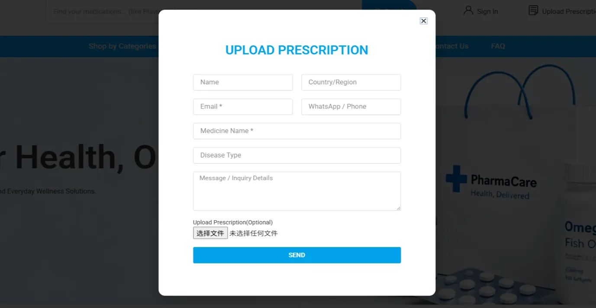

With the development of online healthcare and cross-border pharmaceutical services, more and more people are searching online for [**prescription medicines**](https://dengyuerx.com/product-category/prescription-medicines/), specialty medicines, and innovative medicines. For patients who require long-term treatment, online pharmacies can reduce the time needed to find medicines and provide more options for medicines that may not be readily available in their local area.

However, prescription medicines are different from ordinary products. **When purchasing prescription medicines, it is important to pay attention not only to price and delivery speed, but also to prescription requirements, medicine sources, information verification, and transportation and storage conditions.**

So, what should you pay attention to when purchasing prescription medicines online? And what steps should you follow if you choose [**DengYueRX**](https://dengyuerx.com/)?

## First, Confirm Your Medication Needs When Purchasing Prescription Medicines

Prescription medicines generally require evaluation by a doctor based on the patient's disease, examination results, and physical condition. Therefore, before purchasing, you should first make sure that you have received a diagnosis and treatment recommendation from a legitimate medical institution or qualified healthcare professional.

In particular, for prescription medicines such as anticancer medicines, targeted therapies, immunotherapies, [rare disease medicines](https://dengyuerx.com/product-category/prescription-medicines/rare-diseases/), and other highly specialized medicines, it is not recommended to choose a medicine solely based on information found online.

If you already have a valid prescription, you should carefully confirm whether the following information is consistent when making a purchase: **the medicine name, strength/specification, dosage form, quantity, and prescription information.**

If you only know the name of the disease but do not have a specific prescription for a medicine, it is also not recommended to select prescription medicines on your own. The role of an online pharmacy is to help users obtain medicines, rather than replace doctors in diagnosing diseases or developing treatment plans.

## Why Do You Need to Upload a Prescription When Purchasing Prescription Medicines?

Unlike ordinary products, purchasing prescription medicines requires greater attention to the appropriateness of medication use and the accuracy of relevant information.

Therefore, when purchasing prescription medicines from **DengYueRX**, users need to **upload a valid prescription** during the purchasing process so that the prescription and medicine information can be verified.

Uploading a prescription is not an unnecessary step. It is intended to make the purchasing process more standardized and transparent.

Prescription information can help confirm:

● The specific medicine the patient needs to purchase;

● The medicine name and specification;

● The usage information recommended by the doctor;

● Whether the purchase quantity is consistent with the prescription;

● Whether the medicine selected by the user is consistent with the prescription information.

**DengYueRX will review the prescription and order information submitted by the user and proceed with the subsequent purchasing process after the relevant information has been confirmed.**

Therefore, if you are preparing to purchase prescription medicines through DengYue RX, it is recommended that you prepare clear and valid prescription documents in advance.

## What Should You Pay Attention to When Uploading a Prescription?

To facilitate subsequent review and order processing, users should ensure that the prescription image or electronic prescription is clear and complete, and that the key information can be identified.

In general, you should pay attention to the following: **clear prescription content → clearly stated medicine name → identifiable specification → complete quantity information → identifiable doctor and medical institution information.**

If the prescription image is unclear, information is missing, or the medicine name cannot be confirmed, additional information may be required.

At the same time, users should ensure that the prescription submitted is genuine, valid, and consistent with their actual purchasing needs.

It should be particularly noted that **uploading a prescription does not mean that the platform will independently change the doctor's treatment plan.**

If the medicine, specification, or quantity in the order differs from the prescription, confirmation should be obtained first rather than changing the medicine or dosage on your own.

## Do Not Only Compare Prices; Pay More Attention to the Source of the Medicine

When purchasing prescription medicines, price is certainly important, but it should not be the only factor to consider.

Consumers should also pay attention to the following information about the medicine:

● Generic name and brand name;

● Manufacturer;

● Medicine specification;

● Packaging information;

● Batch number and expiration date;

● Storage conditions;

● Supply channel.

Some unreliable online pharmacies may attract consumers with extremely low prices while not requiring prescriptions. The FDA reminds consumers that such websites may sell unapproved, counterfeit, or otherwise potentially unsafe medicines.

Therefore, when purchasing prescription medicines, **the requirement for a valid prescription and transparent medicine information can actually be important safety signals to consider.**

## Special Medicines Also Require Attention to Transportation and Storage

Some prescription medicines, particularly certain biological products and specialty medicines, may have specific requirements regarding temperature, light exposure, and transportation conditions.

Therefore, if the medicine you are purchasing requires special storage, you should understand the storage conditions specified in the medicine's instructions in advance and confirm whether the relevant transportation method is suitable for the medicine.

## Cross-Border Purchases Also Require an Understanding of Destination-Country Regulations

If you purchase medicines through an international online pharmacy, you also need to consider the relevant regulations of the destination country or region.

Different countries may have different requirements regarding the importation of prescription medicines, quantities for personal use, prescription documents, and specialty medicines. Therefore, before purchasing, users should understand the relevant local regulations and confirm that they meet the legal and compliant requirements for purchasing medicines.

For international users, choosing a pharmacy that can clearly explain its purchasing process, prescription requirements, and transportation methods can help reduce unnecessary communication costs.

## Why Choose DengYueRX?

For international users looking for Chinese medicines, innovative medicines, and specialty medicines, finding a stable and transparent supply channel can be challenging.

**DengYue RX** is committed to providing professional online pharmaceutical services for international users, with a focus on prescription medicines, specialty medicines, innovative medicines, and other specific medication needs.

We place greater emphasis on information verification throughout the purchasing process rather than simply completing an order.

For prescription medicines, users need to first prepare a valid prescription and **upload the prescription** according to the platform's process. After receiving the prescription information, DengYue RX reviews it against the prescription and order information. Once the medicine name, specification, and other relevant information have been confirmed, the subsequent purchasing process can proceed.

This process allows users to further confirm before purchasing that the medicine they have selected is consistent with their prescription information, while also making the entire online purchasing process clearer.

## From “Finding a Medicine” to “Purchasing the Right Medicine”

The value of online medicine purchasing is not simply about helping users find medicines online. More importantly, it is about making the entire process more **transparent, professional, and standardized**.

Especially for prescription medicines, what truly deserves attention is not simply **“Can I place an order directly?”**, but rather:

● **Do I have a prescription?**

● **Is the medicine consistent with the prescription?**

● **Is the source of the medicine clear?**

● **Are the transportation conditions appropriate?**

● **Is the purchasing process transparent?**

At [**DengYue online Pharmacy**](https://dengyuerx.com/), purchasing prescription medicines requires users to upload a prescription. This is an important step in our commitment to a standardized medicine purchasing process.

If you already have a valid prescription issued by a legitimate medical institution and are looking for Chinese medicines or specialty medicines, you can prepare the relevant prescription information and contact DengYue RX to learn more about medicine availability and the subsequent purchasing process.
